# DOGGY HUB

[Doggy Hub](https://frankkode.github.io/dog-service/)

The Doggy Hub is a web app that has been created to reach out to individuals who own dogs and help them to find dogs services around sweden and neighbors countries,take care of abandoned dogs and help to find new home for them

In order to help them achieve this, the users are able to add location, type of service he want and search. The user will be able to locate all the nearby "dog services" around their area,or contact us if he want to give away his dog.

Different links concern dog's life, behavious were provided on the footer

Furthermore, the users are able to contact us for more information.

## THE PURPOSE

The purpose of the appliciation is to enable Dog owners to quickly and easily locate dog services by location, and save the dogs that have no homes.

## Developer goals

- To allow the user to search pre-defined dog services for any given location in sweden and neibour countries.
- Based upon the location entered, google API retrieve company location details, contact details, website links and reviews.
- to be User friendly and simple to use.
- To display the information in a clear and concise manner.
- Translation of the web using google translator.
- Contact us if you do no longer have means to keep your dog.

## Users who would be interested in this web app: (Target dog owners)

- Someone looking for a dog walkout.
- Someone looking for an advice/help for their dogs.
- Someone looking for a dog's food store.
- Someone looking for dog's home care.
- Someone looking for dog's clinic.
- Someone looking for dog's gloom.
- Someone looking for dog's trainer.
- someone who want to give away his dog.
- someone who want to adopt a dog.

## Demo

[LIVE APP](https://frankkode.github.io/dog-service/)

## Getting Started/Deployment

- If you wish to run this site locally, please clone or download this repo. You can then run index.html or open index.html in your browser.
- If you wish to deploy a live version of this site, then you will need to create your own Github repo. Navigate to settings and enable Github Pages by setting the Source to master branch.
- If you wish to view the site via GitHub Pages, please copy this URL into your browser "https://frankkode.github.io/dog-service/".

## Built With

**HTML, CSS, FLEXBOX,bootstrap, JAVASCRIPT, jQUERY, FONT-AWESOME,typekit, GOOGLE-FONTS, GOOGLE-MAPS/PLACES API,animation, BALSAMIQ.**

## UX Design

The UX design approached the design of the site using the 5 layers approach. (Strategy, Structure,Scope, Skeleton, Surface)

MAIN PAGE : 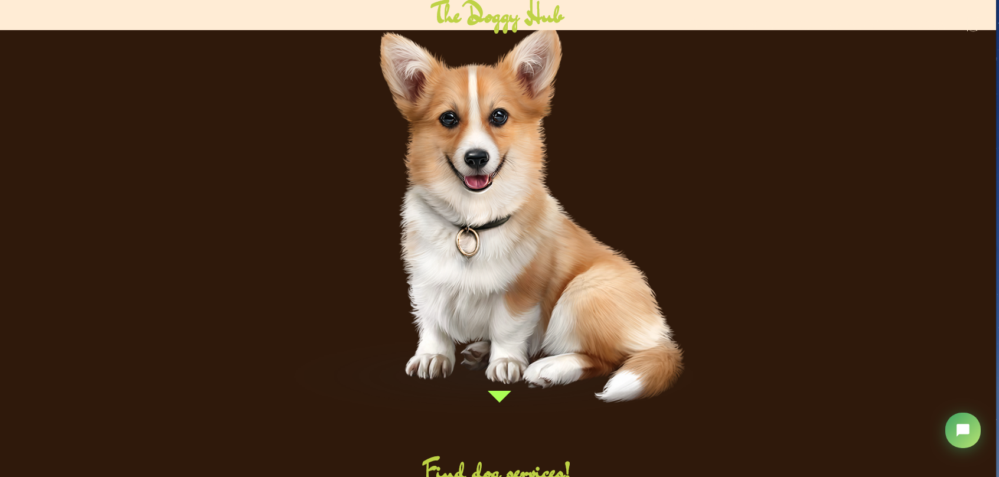

## UX

### This application was developed for the following stories

- As a user, I want to know where to buy dog's food
- As a user, I want to know where to find dog's clinic.
- As a user, I want to train my dog.
- As a user, I want to know where to find dog's daycare.
- As a user, I want to know where to find dog's groom.
- As a user, I want to know where to find dog's shop.
- As a user, I want to know where to find dog's walk ground .
- As a user, i want a dog to adopt.
- As a user, i want to give away my dog.

## Build Approach

1. I built the site using a Mobile First Approach
   was designed to be responsive on all available platforms such as desktops, tablets and mobile phones.

2. The Google Places API is called to retreive data according to user input. The user has a choice of 6 dog services to choose from, along with a location of their choosing. Data is populated dynamically below the landing page. Information includes company name, address, website, phone number, overall rating and reviews if available

[Wireframes](https://balsamiq.cloud/sp80cl3/pdmrm14/r2278?f=N4IgUiBcCMA0IDkpxAYWfAMhkAhHAsjgFo4DSUA2gLoC%2BQA%3D)

### initial wireframes design for this web app

SKELLETON: 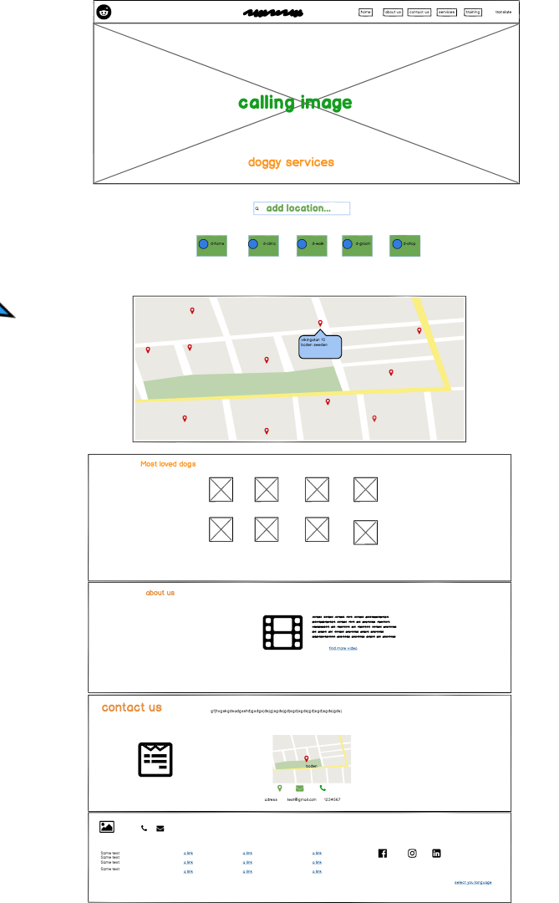

## Features

### Navigation around the site

The website consists of five different web parts: Home , contact us, services, about and training.

The navigation bar changes into a toggler when viewed on a smaller sized screen such as mobile phone. When the screen size is shrinks, the “Menu” button appears which then can be clickable to display a dropdown menu that enables the navigation through the app.

Home Page:

This home page is quite a basic intro page for the user when they land on the web app. On here you find calling image of beatful and healthy dog.

This is quite a summary to quickly cover what the web app is about.

HOME small screen: 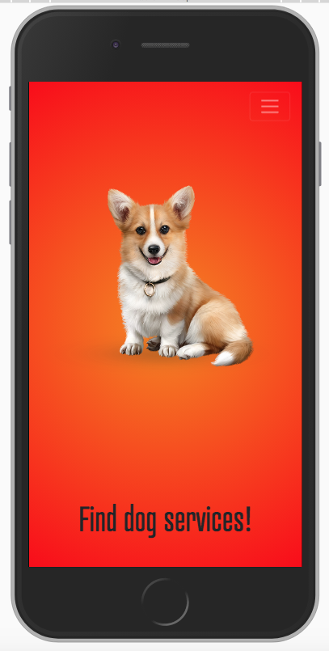

HOME big screen: 

About Page:

On this page, I have talked about the site, who we are and what is our initiative.

ABOUT big screen: 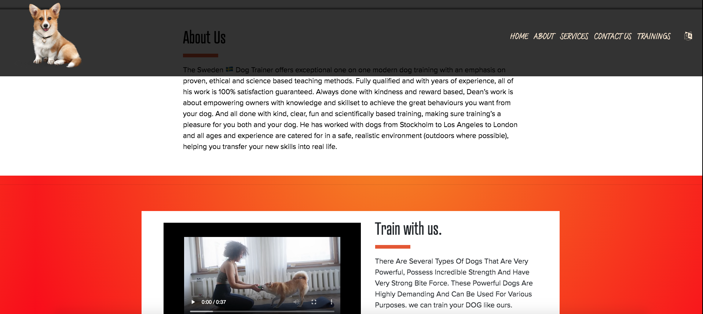

## services Page

On this page, I provided a form with buttons that takes a user to the choosen servive.

I have implemented 6 button link d-walk, s-sit, d-boad, d-vet, d-shop, d-groom . These links will take the user to the services provided by google map place.

In terms of responsiveness, The buttons will be centered on mobile, the button will shrink to fit the width af all devices.

SERVICES wireframe: 

SERVICES small screen: 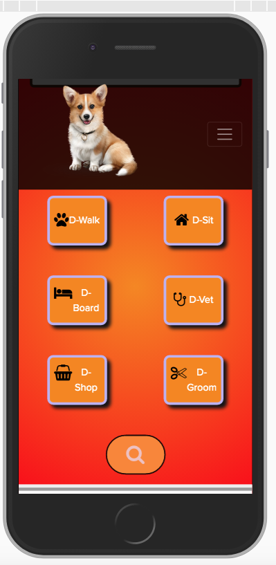

SERVICES big screen: 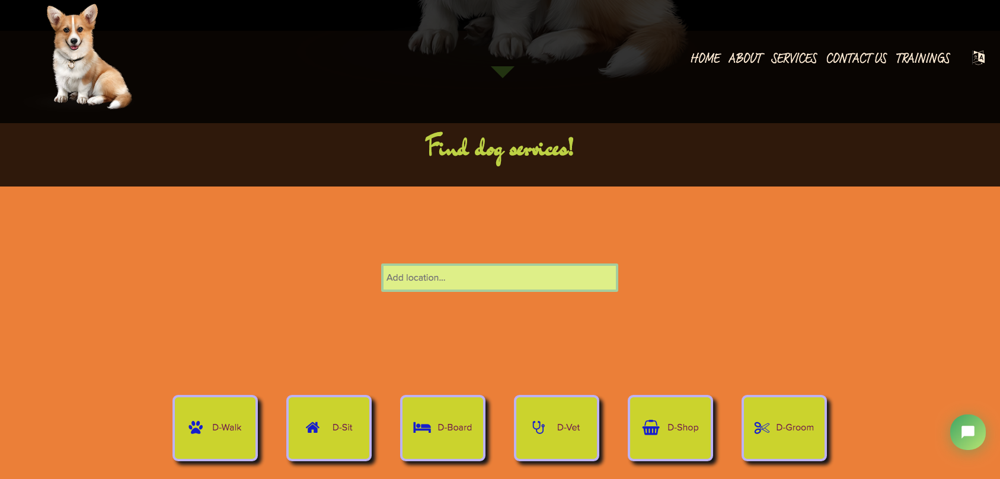

## ADOPTION SECTION

- here you can find pictures and names of the dogs that are waiting to get new homes

ADOPTION DOGS small screen: 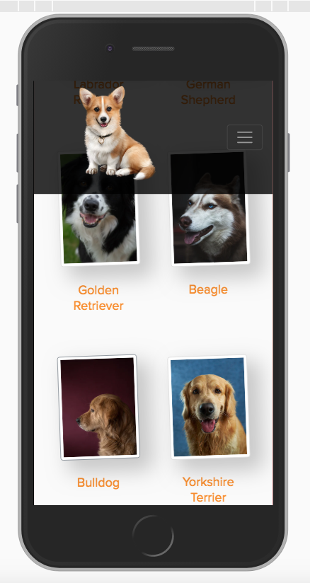

ADOPTION DOGS big screen: 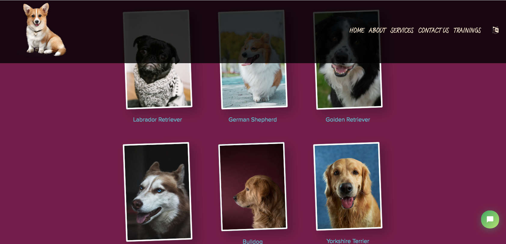

## Contact Page

The contact section consists of a form which can be used for the user to get in touch with me directly. or to ask for general question or tips.

To do this section, I have also implemented a google maps API which shows our office location.

The google maps API fetches the location and shows the nearby place.

These features are all responsive within the web app and can enlarge/shrink in a suitable matter to meet the right user experience needs depending on the size of the screen.

CONTACT US big screen: 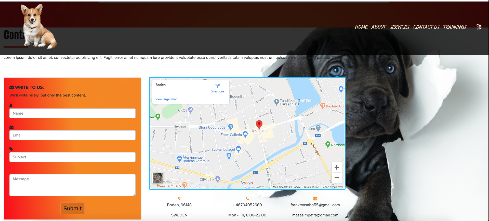

## Trainings

on this section you will see the video showing how to train your dog and a link to training page on youtube

## The footer

- The footer includes links to all my social media pages. In case they want to get in touch through different platforms or view my profile.
  direct link to call us and to email us.

- Links to different helpfull associations, adoption and dog's rights.

- There is also a disclaimer for copyright at the very bottom of the web app.

- Links to different helpfull association, adoption and dog's rights

FOOTER: 

### Features to implement in the future

Setting the contact page to send an automated email to the recipient once they submit a successful message delivered to me. This way they receive a confirmation that I have received their email and will get in touch as soon as possible.

## Technologies used

[HTML/HTML5](https://developer.mozilla.org/en-US/docs/Web/HTML) – This was used to implement most of the content on the site.

[CSS](https://www.w3.org/Style/CSS/Overview.en.html) – This was used for the design/look and feel of the site.

[MAILJS](https://developers.google.com/gmail/api) - This was used to send email to admin.

[TIDIO](https://www.tidio.com/) - Tis was used to imprement chat app for user and admin.

[Git](https://github.com/) – Used as a repository for version control.

[Github](https://github.com/) - Used to host the files and the web app itself.

[Vscode](https://code.visualstudio.com/) – This is the platform used for developing the web app.

[Bootstrap](https://getbootstrap.com/) – This was used mainly for navigation purposes and to aid in making the web app responsive.

[Fotnawesome](https://fontawesome.com/) - This was used to fetch the icons for the social media platforms in the footer

[JavaScript](https://developers.google.com/maps/documentation/javascript/reference/3) This was used to implement the google maps API,animation as well imprementing mailjs

[Gradient](https://cssgradient.io/) free color mixer

[Kibalabs](https://everysize.kibalabs.com/) was used for testing

[Coveer](https://coverr.co/search?q=dog)a free video

## Testing

### Generic/Journey testing

The following have been tested from a user’s perspective to ensure the web app works as expected

- Easy to navigate around the web app as the navigation bar/drop-down menu is easily visible on the web app.
- Each part of the web app are easily to access, easy to navigate around and easy to read/understand.
- Easy detects the location (once the user search for services) and displays all nearby services.
- Shows clear understanding to the user that this is a dog services based web app.
- The user can easily see what nearby dog services including the full name, adress, rating and website.
- The user is easily able to read all web app content as the font is large and clear.

## Manual and technical testing of the site was undertaken and passed

- Chrome/Firefox dev tools was used throughout to test responsiveness and function.
- Testing the site across different devices in real world scenarios. Mobiles, Tablets, Laptops, and Desktops.

ALL DEVICES: 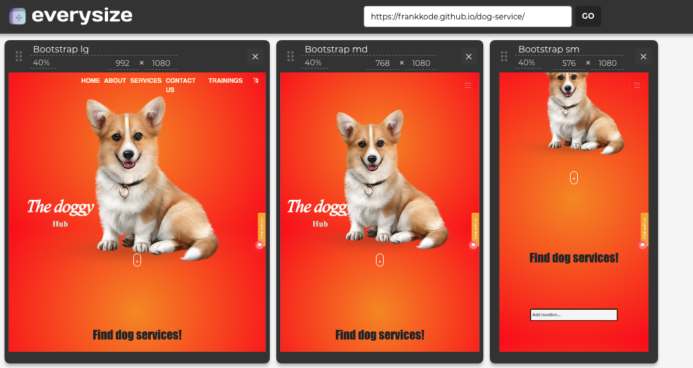

- Giving the application to third party users to get feedback, and see if they could "break" the application.

- W3C code validator to pass HTML, CSS and JS.

HTML TEST: 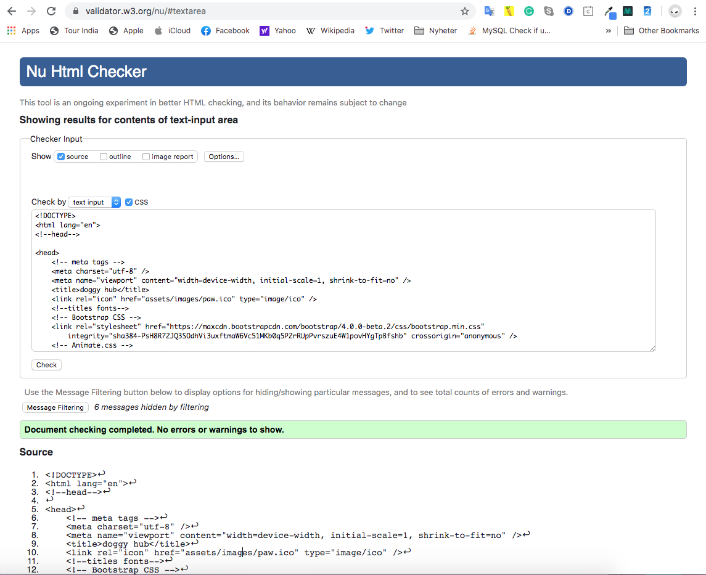

CSS TEST: 

JAVASCRIPT Test: 

- I tested the application across multiple desktop browsers including Firefox, Chrome, Opera and Safari and all is well with these browsers.

Test: 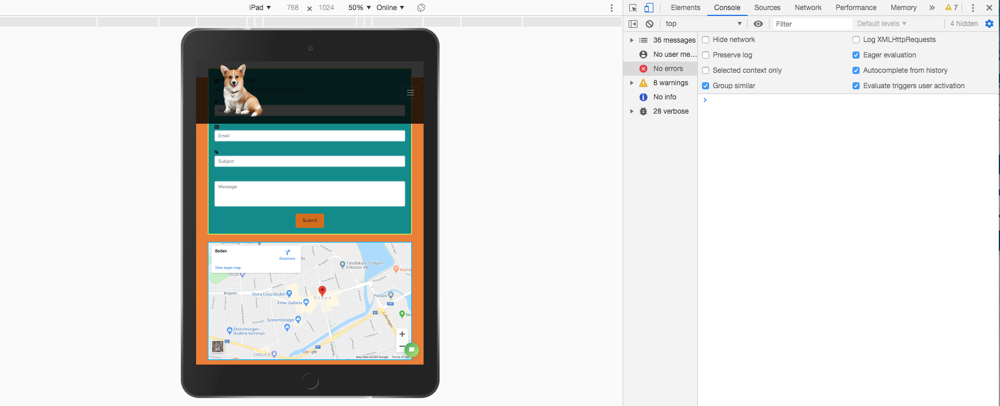

- Navigation links: Each navigation link has been tested to ensure that it is linked to the correct section. The navigation link has also been tested when viewed on a smaller screen sizes to ensure the functionality is consistent making sure the toggler is activated correctly.

- Contact links: I have tested these links to makesure that they redirect correctly to the contact form for the user to get in touch.
- Google maps API (Allowing location): I have tested this on my end to make sure that when location is enabled, the map shows the exact correct location of my area and displays all nearby dog services.

Google maps API (clicking on the marker): I have tested all the markers to make sure that each place dispalys the full name and the rating.

- Contact form: Each field was tested thoroughly to make sure that the mandatory functionality worked. I have tested the following fields: Full name, email address, subject, message. The form has failed to submit if any of the fields was left blank. I have also tested that the modal window pops up confirming that the form has been submitted when processed successfully. The email address field has also been tested when trying to insert an invalid email address. The form fails to submit as the email address is not written in the correct format.
- Social media icons: The social media icons in the footer section have all been tested to make sure they are linked correctly and work fine. The “blank” attribute have also been tested on all of them to make sure that when they are clicked, a new window is open rather than navigating away from the web app.
- Button hover: The button with the hover effect have been tested across the web app. The functionality was working correctly and it changes colour when hovered over.

All images have been tested to make sure they change size when resizing the screen. Background images were tested to make sure that they are covering each section no matter what the screen size is.

The web app content was checked and tested to make sure that there was no error.

## Cross browser/device testing

### iPad

Safari: The web app has been tested to make sure all sections are appearing correctly on iPad making sure the media queries are working as expected. This has been tested as landscape as well as portrait.

Chrome: The web app has also been tested on the chrome browser making sure it is displayed consistently a long with Safari on the iPad device.

iPad: 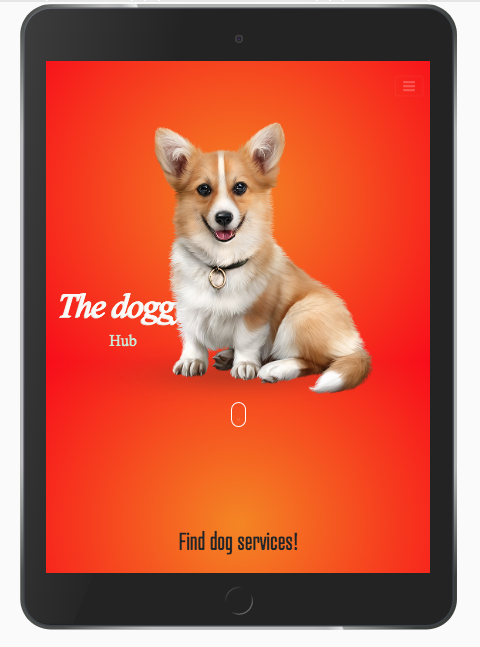

Desktop:

Chrome: Testing was done to make sure all images/content was displayed clearly on the large desktop screen.

Firefox: Testing was also carried on Firefox to make sure everything is consistent with chrome.

Android phone:

Android internet: Tested mainly to make sure the web app is responsive correctly on small screen sizes. This was tested through landscape and portrait orientation.

Chrome: The web app was also tested on chrome mainly for orientation purposes.

## Issues found and resolved

The google maps on the services page was not displaying correctly in size and not stretching across the container. This was due to certain bootstrap classes which prevented it from showing in width of 100%. The classes have been removed and the map is displayed correctly.

## Deployment

This project was developed using the vscode, this was then committed to git and pushed to GitHub through the terminal.

### To run the project locally by cloning from GitHub do the following

Click this [link](https://github.com/frankkode/dog-service) to go to the projects GitHub Repositry.
Click the green Clone or download dropdown at the top right.
Copy the URL in the box under Clone to HTTPS.[dog services](https://github.com/frankkode/dog-service)
Open Git Bash in your local IDE.
Change the current working directory to the location you want the cloned directory to be made.
Type git clone, then paste the URL that you copied earlier. [dog services](https://github.com/frankkode/dog-service)
then Press Enter, your local clone will be created.
from there you can open live app localy

## Credits

### Media

The background image, the loved dogs images was taken from free image website unsplash and slightly edited by me through an image editor.

[google developers](https://developers.google.com/) was used to help me implement the google maps API on my website and to locate the geolocation of the services.

## Authors

**FRANK M** - this site was created as part of Code Institute's Web Development Online Full-Stack Course.

## Acknowledgments

1. [jQuery](https://jqueryui.com/menu/)

2. [w3c Validator service](https://validator.w3.org/)
3. [Google Fonts](https://fonts.google.com/)
4. [Unsplash](https://unsplash.com/)
5. [Coverr](https://coverr.co/search?q=dog)
6. [Font-awesome](https://fontawesome.com/)
7. [Stack Overflow](https://stackoverflow.com/)
8. [Google Maps - Places API](https://developers.google.com/maps/documentation/javascript/reference/3)
9. [Bootstrap](https://getbootstrap.com/docs/4.3/getting-started/download/)
10. [Tidio](https://www.tidio.com/)
11. [Gradient](https://cssgradient.io/)
12. [Code institute](https://courses.codeinstitute.net/)

## Disclaimer

- The content of this website was created for educational purposes.
